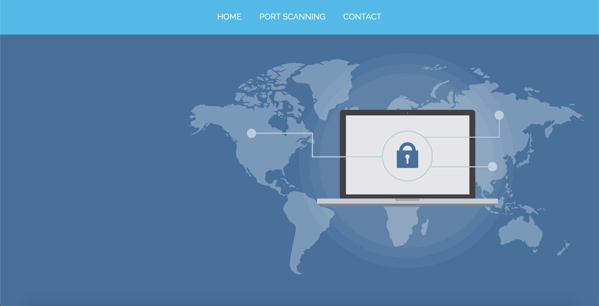
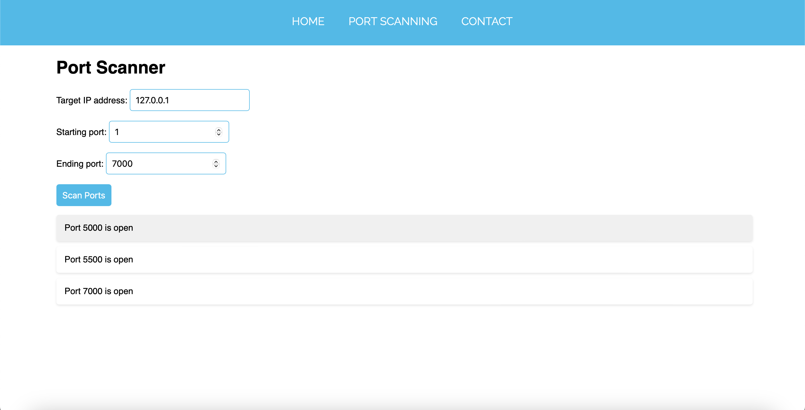

# CyberTrace

CyberTrace is a comprehensive port scanning application designed to help you analyze and monitor network security by scanning for open ports on target IP addresses. With its intuitive interface and powerful features, CyberTrace enables you to identify potential vulnerabilities and secure your network effectively.

## Features
- Scan ports within a specified range
- Visualize scan results with detailed information
- Responsive design for seamless usage on various devices
- Easy-to-use interface for initiating and managing port scans

## Getting Started
To get started with CyberTrace, follow these steps:
1. Clone this repository to your local machine.
2. Open the `index.html` file in your web browser.
3. Enter the target IP address, starting port, and ending port in the provided fields.
4. Click on the "Scan Ports" button to initiate the port scan.
5. View the scan results displayed on the page and analyze potential vulnerabilities.

## Future Enhancements
- Implement additional scanning techniques such as SYN scanning and UDP scanning for comprehensive network analysis.
- Add support for scanning multiple IP addresses simultaneously to streamline large-scale security assessments.
- Enhance error handling and user feedback mechanisms to provide a seamless user experience.
- Incorporate advanced visualization tools to represent scan results in an easily interpretable format.

## Feedback and Contributions
Feedback and contributions are highly appreciated! If you encounter any issues, have suggestions for improvement, or would like to contribute to CyberTrace, please feel free to open an issue or submit a pull request.

## License
This project is licensed under the MIT License - see the [LICENSE](LICENSE) file for details.

