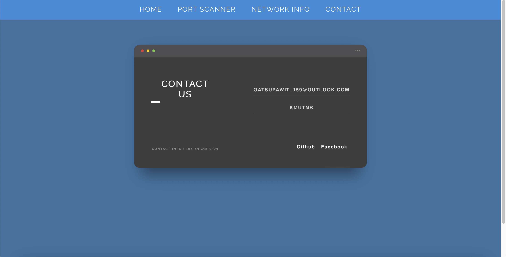

# CyberTrace

CyberTrace is a comprehensive network monitoring and security application designed to help you analyze and manage network resources effectively. It provides features such as port scanning, network information retrieval, and contact information display.

## Features
- **Port Scanner:** Scan ports within a specified range on a target IP address.
- **Network Info:** Retrieve information about the network interface, including computer name, private IP address, network prefix length, and MAC address.
- **Contact Us:** Display contact information for reaching out to the application developers.

## Getting Started
To use CyberTrace, follow these steps:
1. Clone this repository to your local machine.
2. Ensure you have Python and Flask installed on your system.
3. Navigate to the project directory and run `python app.py`.
4. Open your web browser and go to `http://localhost:5000/` to access the application.

## Future Enhancements
- Improve error handling and user feedback mechanisms for a smoother user experience.
- Enhance the contact section to include a contact form for users to send messages directly.
- Implement additional security features such as authentication and authorization.
- Expand network information retrieval to include more detailed data about network interfaces and configurations.

## Feedback and Contributions
Feedback and contributions are welcome! If you have any suggestions, encounter issues, or want to contribute to CyberTrace, please feel free to open an issue or submit a pull request.

## License
This project is licensed under the MIT License - see the [LICENSE](LICENSE) file for details.

## Screenshots

